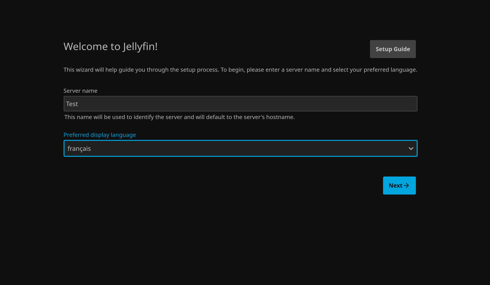
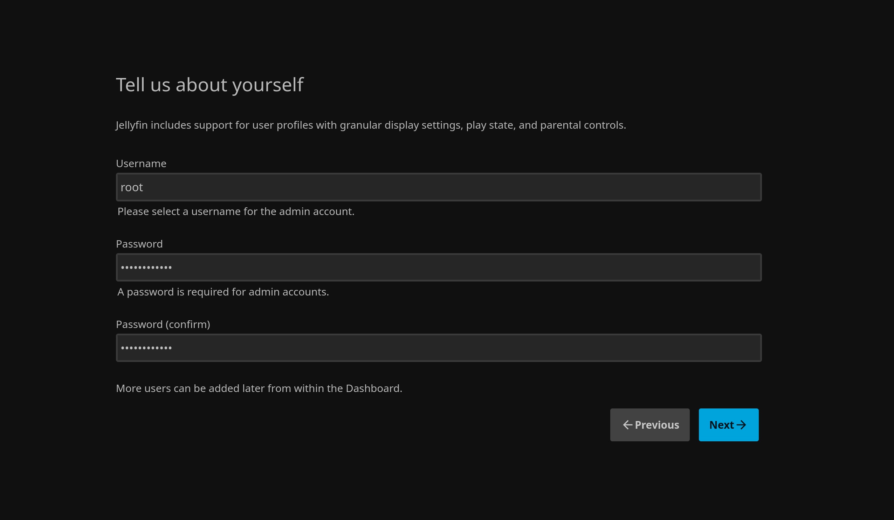
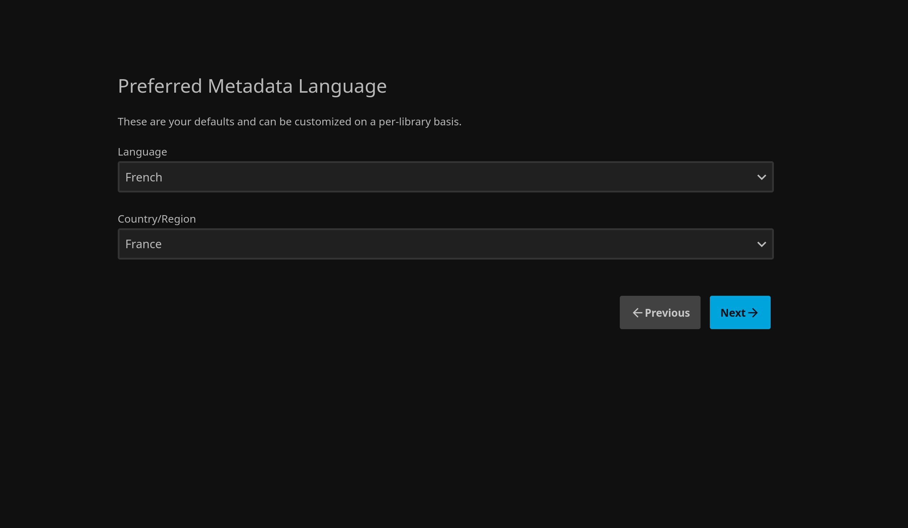
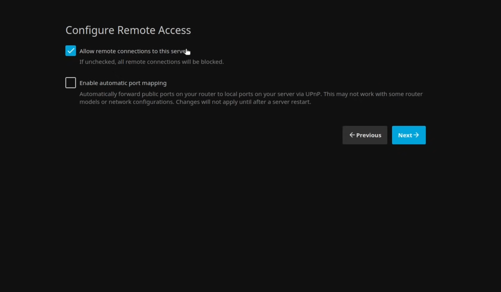
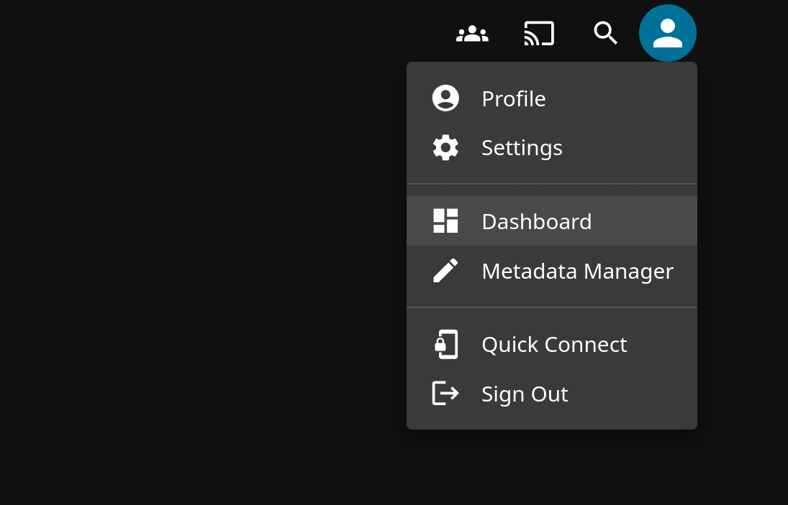
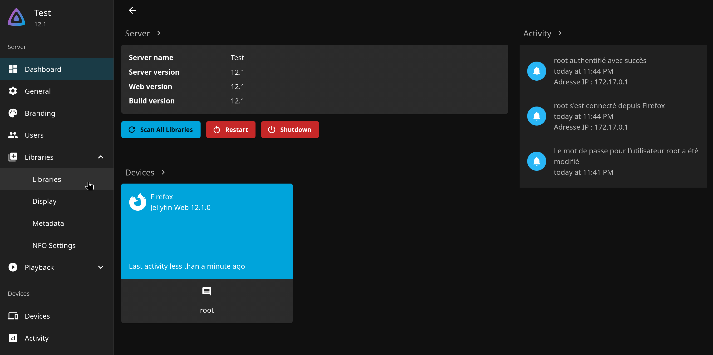
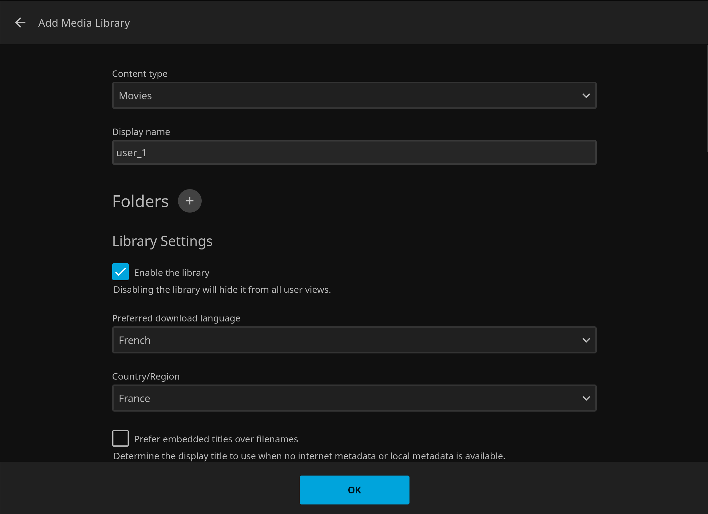
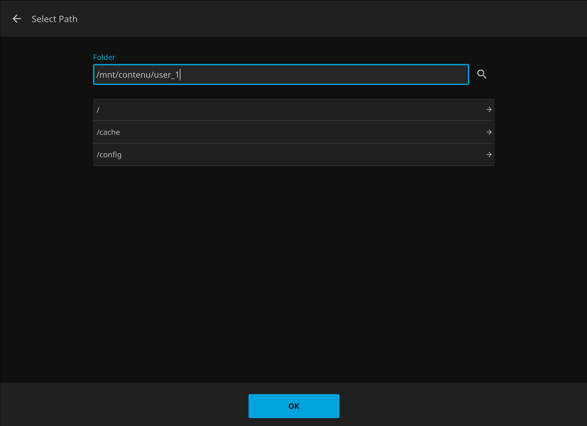
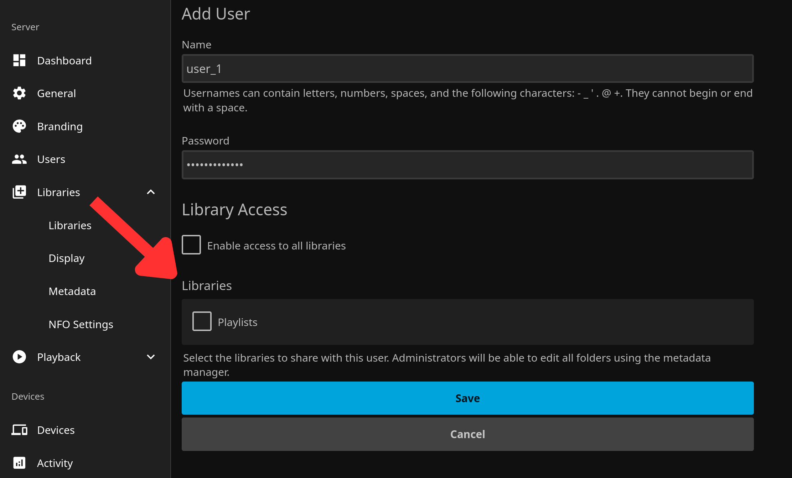

# CineBrain

**CineBrain** est un écosystème qui combine Jellyfin et un pipeline de recherche/téléchargement automatisé pour organiser et visionner sa médiathèque personnelle.

---

## Pourquoi ce projet ?

L'objectif de **CineBrain** est d'éliminer la complexité liée au téléchargement et à la gestion manuelle des films et séries :

- **Recherche en langage naturel** : Plus besoin de chercher manuellement sur plusieurs sites de torrents, de vérifier la qualité ou la langue.
- **Automatisation totale** : De la demande initiale de l'utilisateur jusqu'à la mise à disposition finale dans la médiathèque Jellyfin, tout le pipeline (recherche, téléchargement sous VPN, organisation des dossiers, transfert sécurisé) est géré automatiquement.
- **Confort de visionnage** : Une fois le média prêt, il apparaît directement dans Jellyfin, prêt à être regardé sur votre TV, PC ou smartphone.

---

## Architecture globale

Le projet repose sur deux blocs indépendants, chacun sur son propre serveur :

1. **Serveur média — Jellyfin** (pve, ce README) : héberge, indexe et diffuse la médiathèque.
2. **Serveur IA & téléchargement** (pve3) : reçoit les demandes, effectue la recherche et le téléchargement, puis dépose les fichiers organisés dans le dossier surveillé par Jellyfin.

## Prérequis matériels

Vous pouvez déployer ce projet selon **deux topologies au choix** :

| Configuration | Description |
| :--- | :--- |
| **2 Serveurs / PC (Recommandé)** | **Serveur 1** : Dédié au traitement IA, VPN et téléchargements.<br>**Serveur 2** : Dédié au stockage et au serveur média Jellyfin.<br>*C'est la meilleure option pour isoler le réseau VPN et garantir une fluidité optimale lors du transcodage vidéo.* |
| **1 Serveur / PC** | L'ensemble des services (IA + Téléchargement + Jellyfin) tourne sur une seule et même machine suffisamment puissante. |

**Remarque** : Il est fortement conseillé d'utiliser **deux machines suffisamment puissantes** pour séparer le flux de téléchargement/VPN des performances de lecture vidéo de Jellyfin.

```
┌───────────────────────┐        ┌──────────────────────────┐
│   Serveur IA (pve3)   │ ─────▶│  Serveur Jellyfin (pve)  │
│   Recherche +         │ dépôt  │  Indexation + streaming  │
│   téléchargement      │ fichier│                          │
└───────────────────────┘        └──────────────────────────┘
```

---

# Partie 1 — Jellyfin

## Structure des dossiers

Jellyfin s'appuie sur une arborescence stricte pour bien reconnaître séries et films :

```text
/mnt/contenu/
├── Serie/
│   ├── Serie-1/
│   │   ├── Season-1/
│   │   │   └── Ep-1/
│   └── Serie-2/
│       └── Season-1/
│           └── Ep-1/
├── User-1/
│   ├── Movie-1/
│   ├── Movie-2/
└── User-2/
    ├── Movie-1/
    └── Movie-2/
```
## Pourquoi ce projet ?

L'objectif de **CineBrain** est d'éliminer la complexité liée au téléchargement et à la gestion manuelle des films et séries :

- **Recherche en langage naturel** : Plus besoin de chercher manuellement sur plusieurs sites de torrents, de vérifier la qualité ou la langue.
- **Automatisation totale** : De la demande initiale de l'utilisateur jusqu'à la mise à disposition finale dans la médiathèque Jellyfin, tout le pipeline (recherche, téléchargement sous VPN, organisation des dossiers, transfert sécurisé) est géré automatiquement.
- **Confort de visionnage** : Une fois le média prêt, il apparaît directement dans Jellyfin, prêt à être regardé sur votre TV, PC ou smartphone.

## 1. Préparation de la machine Debian

Config utilisée pour cette machine Debian :

| Ressource | Allocation |
|---|---|
| vCPU | à ajuster selon le nombre de flux simultanés visés |
| RAM | dimensionnée selon l'usage réel (voir historique de conso dans Grafana avant de fixer une valeur définitive) |
| Disque système | 20-30 Go suffit (Jellyfin lui-même est léger) |
| Stockage média | monté séparément, voir section suivante |

## 2. Montage du stockage média

Le dossier `/mnt/films` (monté dans le conteneur sur `/data/movies`) doit provenir du stockage dédié (disque secondaire ou partage NFS/TrueNAS), pas du disque système de la machine Linux.

```bash
sudo mkdir -p /mnt/films
```

## 3. Installation de Jellyfin via Docker

```bash
mkdir -p /opt/jellyfin
cd /opt/jellyfin
nano docker-compose.yml
```

```yaml
services:
  jellyfin:
    image: jellyfin/jellyfin
    container_name: jellyfin
    network_mode: host
    volumes:
      - /opt/jellyfin/config:/config
      - /opt/jellyfin/cache:/cache
      - /mnt/films:/data/movies
    restart: unless-stopped
```

```bash
docker compose up --build -d
```

## 4. Premier accès et assistant de configuration

Accès via `http://IP_DE_LA_MACHINE:8096`. L'assistant demande :
- Nom du Serveur
- Langue de l'interface
- Création du compte administrateur
- Ajout des bibliothèques (pointer vers `/mnt/contenu/Serie` et les dossiers `User-X`)

| Langue + Nom | Compte admin |
|---|---|
|  |  |
 
| Préférence des metadatas | Accès distant |
|---|---|
|  |  |

## 5. Login + Config

Pour commencer la config huration il va falloir commencer par se log avec **root** qu'on a créé.

En haut à droite, cliquer sur l'icon du profile puis cliquer sur **Dashboard**




## 5. Configuration des bibliothèques

Pour chaque dossier ajouté, choisir le bon type de contenu (Séries / Films) afin que Jellyfin applique le bon système de reconnaissance (affiches, résumés, épisodes).



## 6. Ajout d'une bibliothèque

Nous allons créer une bibliothèque dédiée pour chaque utilisateur.

Nous avons pour exemple user_1 qui veut avoir des films uniquement sur son compte, non pas accessible par tout les autres utilisateurs qui ont accès au serveur jellyfin.

Avant de créer la bibliothèque dans Jellyfin, il faut d'abord créer le dossier dédié sur le serveur, dans le point de montage prévu pour les médias :

```bash
mkdir -p /mnt/contenu/user_1
```

| Lib user_1 | Dossier user_1 |
|---|---|
|  |  |

## 7. Création des comptes utilisateurs

Un compte par utilisateur (`User-1`, `User-2`...) dans **Tableau de bord → Utilisateurs**, avec accès restreint à ses propres dossiers si besoin de séparation.



La lib concerné s'affichera dans **libraries**, surtout ne JAMAIS mettre **Enable access all libraries**

## 8. Vérification finale

- Lecture d'un fichier test depuis un navigateur
- Lecture depuis l'app mobile/TV Jellyfin
- Vérification que le transcodage fonctionne (si activé) sur un appareil ne supportant pas le format source

---

# Partie 2 — IA & Téléchargement

*En cours..*
