<h1 align="center">CineBrain</h1>

<p align="center">
  
</p>

**CineBrain** est un écosystème qui combine Jellyfin et un pipeline de recherche/téléchargement automatisé pour organiser et visionner sa médiathèque personnelle.

---

## Pourquoi ce projet ?

L'objectif de **CineBrain** est d'éliminer la complexité liée au téléchargement et à la gestion manuelle des films et séries :

- **Recherche en langage naturel** : Plus besoin de chercher manuellement sur plusieurs sites de torrents, de vérifier la qualité ou la langue.
- **Automatisation totale** : De la demande initiale de l'utilisateur jusqu'à la mise à disposition finale dans la médiathèque Jellyfin, tout le pipeline (recherche, téléchargement sous VPN, organisation des dossiers, transfert sécurisé) est géré automatiquement.
- **Confort de visionnage** : Une fois le média prêt, il apparaît directement dans Jellyfin, prêt à être regardé sur votre TV, PC ou smartphone.

---

## Architecture globale

Le projet repose sur deux blocs indépendants, chacun sur son propre serveur :

1. **Serveur média — Jellyfin** : héberge, indexe et diffuse la médiathèque.
2. **Serveur IA & téléchargement** : reçoit les demandes, effectue la recherche et le téléchargement, puis dépose les fichiers organisés dans le dossier surveillé par Jellyfin.

## Prérequis matériels

Vous pouvez déployer ce projet selon **deux topologies au choix** :

| Configuration | Description |
| :--- | :--- |
| **2 Serveurs / PC (Recommandé)** | **Serveur 1** : Dédié au traitement IA, VPN et téléchargements.<br>**Serveur 2** : Dédié au stockage et au serveur média Jellyfin.<br>*C'est la meilleure option pour isoler le réseau VPN et garantir une fluidité optimale lors du transcodage vidéo.* |
| **1 Serveur / PC** | L'ensemble des services (IA + Téléchargement + Jellyfin) tourne sur une seule et même machine suffisamment puissante. |

**Remarque** : Il est fortement conseillé d'utiliser **deux machines suffisamment puissantes** pour séparer le flux de téléchargement/VPN des performances de lecture vidéo de Jellyfin.

```
┌───────────────────────┐        ┌──────────────────────────┐
│   Serveur IA          │ ─────▶│  Serveur Jellyfin        │
│   Recherche +         │ dépôt  │  Indexation + streaming  │
│   téléchargement      │ fichier│                          │
└───────────────────────┘        └──────────────────────────┘
```

---

# Partie 1 — Jellyfin

## Structure des dossiers

Jellyfin s'appuie sur une arborescence stricte pour bien reconnaître séries et films :

```text
/mnt/contenu/
├── Serie/
│   ├── Serie-1/
│   │   ├── Season-1/
│   │   │   └── Ep-1/
│   └── Serie-2/
│       └── Season-1/
│           └── Ep-1/
├── User-1/
│   ├── Movie-1/
│   ├── Movie-2/
└── User-2/
    ├── Movie-1/
    └── Movie-2/
```

## 1. Préparation de la machine Debian

Config utilisée pour cette machine Debian :

| Ressource | Allocation |
|---|---|
| vCPU | à ajuster selon le nombre de flux simultanés visés |
| RAM | dimensionnée selon l'usage réel (voir historique de conso dans Grafana avant de fixer une valeur définitive) |
| Disque système | 20-30 Go suffit (Jellyfin lui-même est léger) |
| Stockage média | monté séparément, voir section suivante |

## 2. Montage du stockage média

Le dossier `/mnt/films` (monté dans le conteneur sur `/data/movies`) doit provenir du stockage dédié (disque secondaire ou partage NFS/TrueNAS), pas du disque système de la machine Linux.

```bash
sudo mkdir -p /mnt/films
```

## 3. Installation de Jellyfin via Docker

```bash
mkdir -p /opt/jellyfin
cd /opt/jellyfin
nano docker-compose.yml
```

```yaml
services:
  jellyfin:
    image: jellyfin/jellyfin
    container_name: jellyfin
    network_mode: host
    volumes:
      - /opt/jellyfin/config:/config
      - /opt/jellyfin/cache:/cache
      - /mnt/films:/data/movies
    restart: unless-stopped
```

```bash
docker compose up --build -d
```

## 4. Premier accès et assistant de configuration

Accès via `http://IP_DE_LA_MACHINE:8096`. L'assistant demande :
- Nom du Serveur
- Langue de l'interface
- Création du compte administrateur
- Ajout des bibliothèques (pointer vers `/mnt/contenu/Serie` et les dossiers `User-X`)

| Langue + Nom | Compte admin |
|---|---|
|  |  |
 
| Préférence des metadatas | Accès distant |
|---|---|
|  |  |

## 5. Login + Config

Pour commencer la config huration il va falloir commencer par se log avec **root** qu'on a créé.

En haut à droite, cliquer sur l'icon du profile puis cliquer sur **Dashboard**


## 5. Configuration des bibliothèques

Pour chaque dossier ajouté, choisir le bon type de contenu (Séries / Films) afin que Jellyfin applique le bon système de reconnaissance (affiches, résumés, épisodes).


## 6. Ajout d'une bibliothèque

Nous allons créer une bibliothèque dédiée pour chaque utilisateur.

Nous avons pour exemple user_1 qui veut avoir des films uniquement sur son compte, non pas accessible par tout les autres utilisateurs qui ont accès au serveur jellyfin.

Avant de créer la bibliothèque dans Jellyfin, il faut d'abord créer le dossier dédié sur le serveur, dans le point de montage prévu pour les médias :

```bash
mkdir -p /mnt/contenu/user_1
```

| Lib user_1 | Dossier user_1 |
|---|---|
|  |  |

## 7. Création des comptes utilisateurs

Un compte par utilisateur (`User-1`, `User-2`...) dans **Tableau de bord → Utilisateurs**, avec accès restreint à ses propres dossiers si besoin de séparation.


La lib concerné s'affichera dans **libraries**, surtout ne JAMAIS mettre **Enable access all libraries**

## 8. Vérification finale

- Lecture d'un fichier test depuis un navigateur
- Lecture depuis l'app mobile/TV Jellyfin
- Vérification que le transcodage fonctionne (si activé) sur un appareil ne supportant pas le format source

---

# Partie 2 — IA & Téléchargement

Cette partie est hébergée sur la seconde machine (**Serveur IA**). Elle rassemble le moteur de traitement en langage naturel (Ollama), le tunnel sécurisé (Gluetun VPN), les indexeurs (Prowlarr), le client de téléchargement (qBittorrent) et le backend d'automatisation.

---

## 1. Structure du projet et des dossiers

Sur le serveur IA, l'ensemble de la stack est centralisé sous `/opt/cinebrain-ia` :

```text
/opt/cinebrain-ia/
├── config/
│   └── Modelfile            # Configuration du modèle LLM local
├── app/                     # Scripts du backend d'automatisation (transfer.py, etc.)
├── downloads/               # Dossier temporaire de téléchargement des torrents
├── .env                     # Variables d'environnement (clés API, identifiants VPN)
└── docker-compose.yml       # Stack complète des conteneurs
```

## 2. Déploiement de la stack via Docker

Créer l'arborescence et le fichier d'environnement :

```bash
mkdir -p /opt/cinebrain-ia/config /opt/cinebrain-ia/app /opt/cinebrain-ia/downloads
cd /opt/cinebrain-ia
nano .env
```

Contenu du fichier `.env`

link

Contenu du `docker-compose.yml`:

link

Démarrer la stack sur le serveur IA :

```bash
docker compose up -d
```

## 3. Fonctionnement du pipeline automatisé

Le code va exécuté dans le backend l'orchestration des actions suivantes :

```text
[ Demande Utilisateur ]
         │
         ▼
[ Ollama (Analyse IA) ] ──▶ Extraction du titre, année, langue
         │
         ▼
[ Prowlarr / VPN ] ───────▶ Recherche sécurisée du meilleur Release
         │
         ▼
[ qBittorrent ] ──────────▶ Téléchargement dans /downloads/User-X/
         │
         ▼
[ Backend ] ─▶ Nettoyage des metadatas & normalisation du nom
         │
         ▼
[ Transfert SCP ] ────────▶ Copie sécurisée vers Serveur Jellyfin (/mnt/contenu/...)
```

Logique de nettoyage et de transfert sécurisé

Le script applique des règles strictes lors de la livraison :
- Détection de type : Identification automatique des séries (S01E01, Saison 1) et des films.
- Nettoyage des tags : Suppression des éléments superflus (1080p, WEB-DL, x264, noms de sites web) sans détruire l'extension du fichier ni l'année ((1997)).
- Gestion des extras : Si un film contient des bonus (Featurettes, Storyboards), les fichiers conservent leurs noms individuels pour éviter d'être écrasés.
- Livraison distante : Création automatique du dossier cible via SSH puis transfert direct avec scp

## 4. Configuration Prowlarr

### Connexion et settings

Accéder à Prowlarr via http://IP_SERVEUR_IA:9696 pour configurer la recherche automatisée :

1. Lorsqu'on arrive sur l'interface de Prowlarr, on va créer l'utilisateur commun.

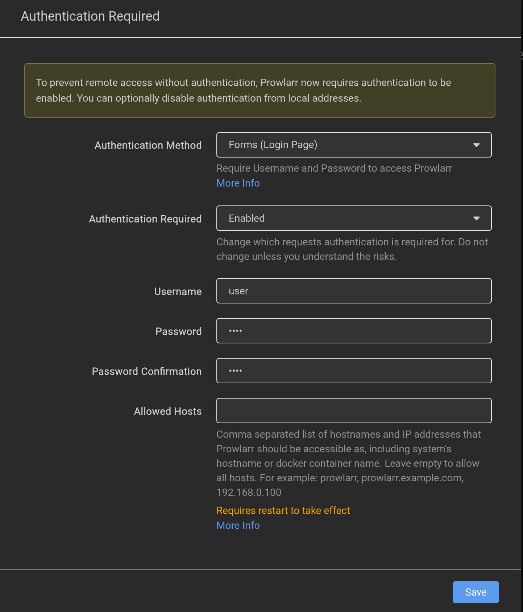

2. Une fois connecté, on se rendre dans **settings** -> **General** pour copier la clé api

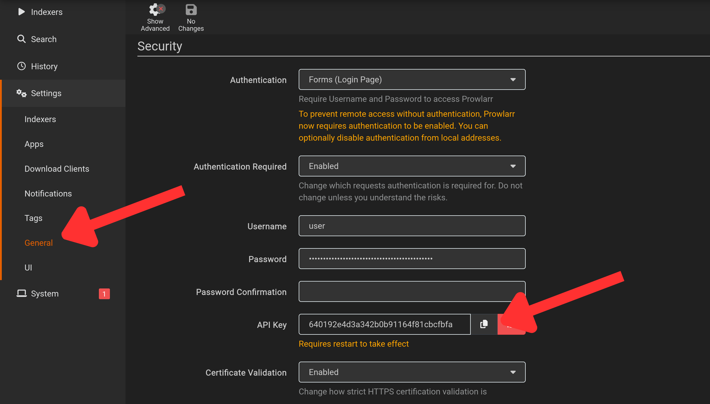

### Ajouter des indexers de recherche

1. Dans **Settings** → **Indexers**, ajouter les catégories de recherche (Films & Séries).

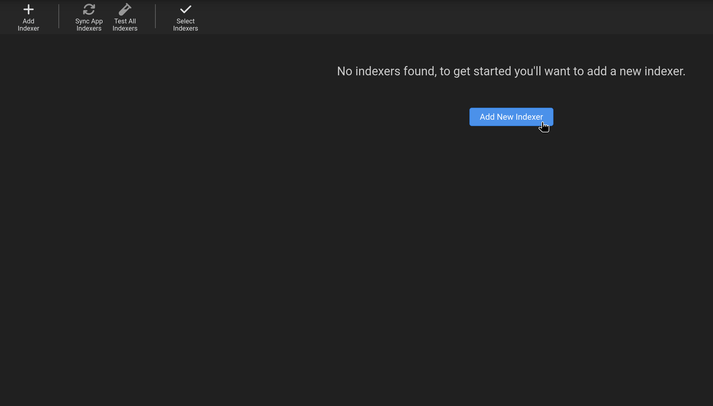

2. Dans **Indexers** → **Add Indexer**, ajouter vos trackers habituels :
  - Différent Indexers testé: The Pirate Bay, LimeTorrents, EZTV et Torrent9.

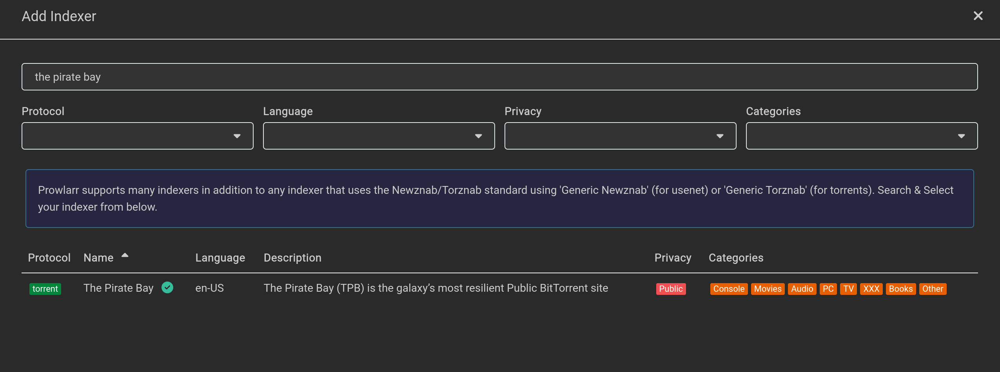

## 5. Configuration qBittorrent

### Connexion

Accéder à qBittorrent via http://IP_SERVEUR_IA:8080 :

Pour trouver le mot de passe de l'interface, il va falloir faire la commande suivant:

```bash
docker compose logs qbittorrent
```

Résultat attendu:

```bash
******** Information ********
To control qBittorrent, access the WebUI at: http://localhost:8080
The WebUI administrator username is: admin
The WebUI administrator password was not set. A temporary password is provided for this session: gznZVC6tb
You should set your own password in program preferences.
Connection to localhost (::1) 8080 port [tcp/http-alt] succeeded!
[ls.io-init] done.
```

Prendre le mot de passe généré temprairement.

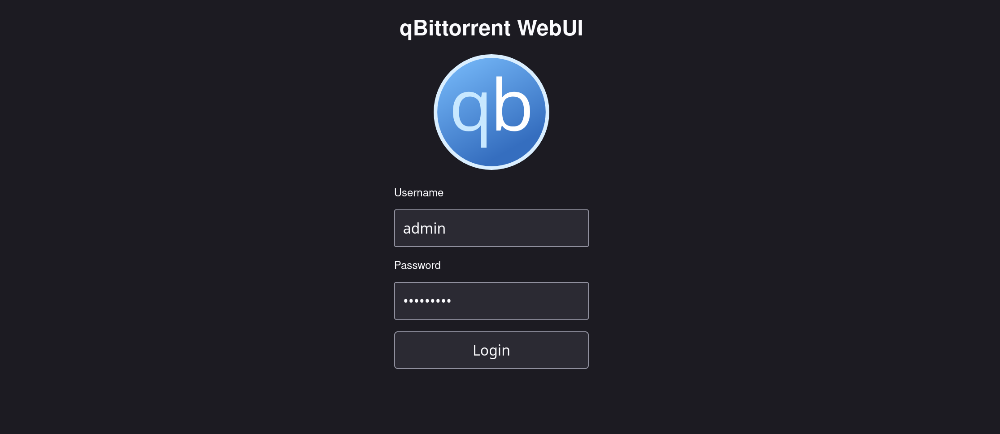

2. Une fois connecté, on va se rendre dans **settings** -> **WebUI** pour modifier le **mot de passe** avec celui dans votre `.env`, cocher **Bypass authentification for client on localhost** et cliquer sur **save**

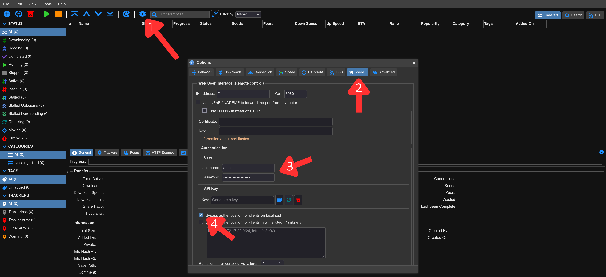

## 6. Ajouter et profiter de vos médias

### L'interface WebUI de CineBrain

Accédez à la page web de votre outil via http://IP_SERVEUR_IA:3000 pour lancer vos recherches :

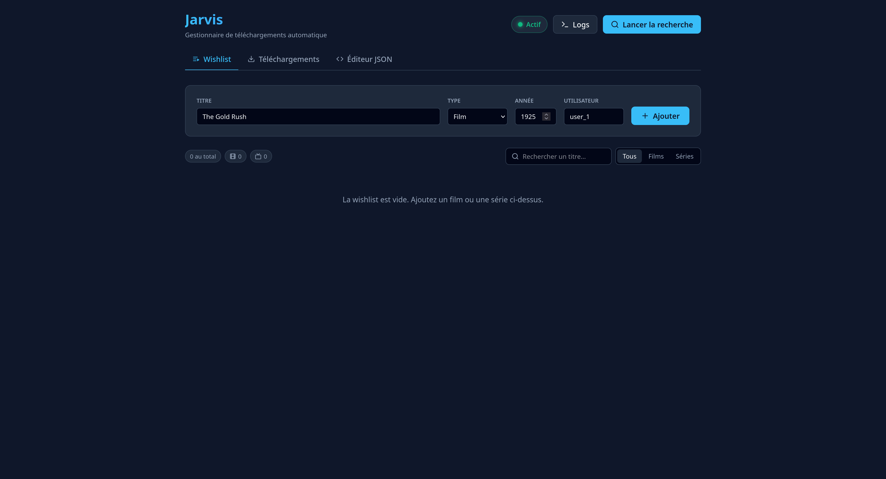

En haut à droite, le voyant indique l'état du VPN : **vert (Actif)** quand le tunnel est connecté, **rouge (Inactif)** s'il est coupé. En survolant le voyant, vous voyez l'IP publique et le pays du VPN.

Il suffit de formuler votre demande et de cliquer sur **Ajouter**.

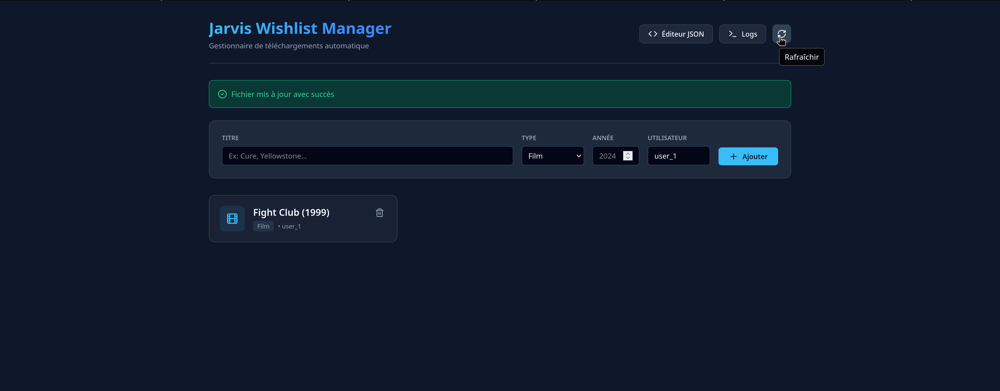

Cliquez sur **Lancer la recherche** pour laisser ensuite l'intelligence artificielle rechercher et télécharger le film de manière 100% autonome.

### Suivi des téléchargements

L'onglet **Téléchargements** affiche en temps réel les torrents en cours dans qBittorrent : progression, taille, vitesse et temps restant. Vous pouvez filtrer par état (en cours, terminés, erreurs).

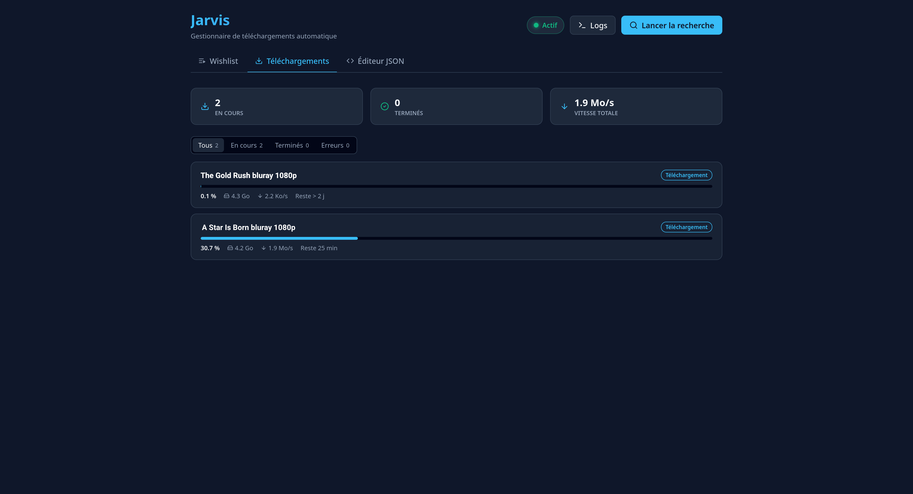

### Éditeur JSON

L'onglet **Éditeur JSON** permet de modifier directement le fichier `wishlist.json`. Le JSON est validé à la volée, et vous pouvez enregistrer avec **Ctrl+S**.

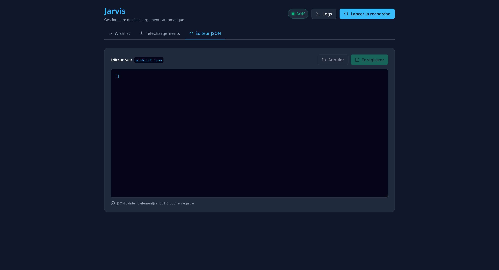

### Logs du backend

Le bouton **Logs** ouvre les logs du backend en direct. Vous pouvez les filtrer par niveau (Info, Avertissements, Erreurs) pour suivre chaque étape : recherche, ajout dans qBittorrent, transfert vers Jellyfin.

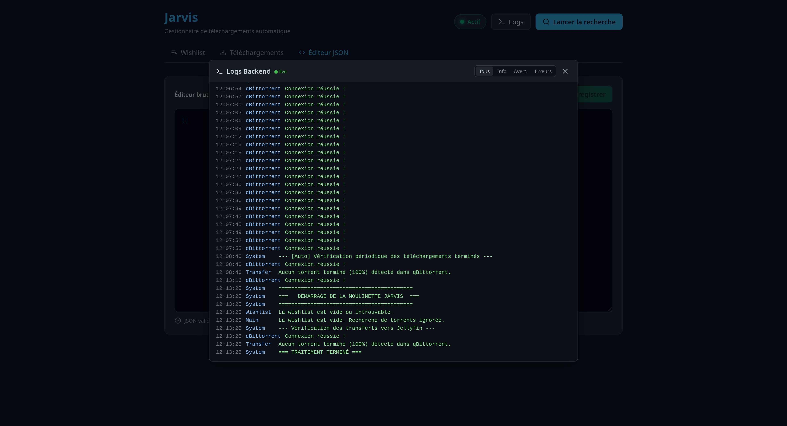

## C'est prêt !

Vous n'avez plus rien à faire. Une fois le téléchargement et le nettoyage terminés, le fichier apparaîtra automatiquement et proprement dans l'interface de votre serveur Jellyfin. Profitez de votre séance !
