<h1 align="center">CineBrain</h1>

<p align="center">
  
</p>

**CineBrain** est un écosystème qui combine Jellyfin et un pipeline de recherche/téléchargement automatisé pour organiser et visionner sa médiathèque personnelle.

> [!IMPORTANT]
> **Usage légal uniquement.** CineBrain est un outil d'automatisation : il ne fournit aucun contenu. Utilisez-le uniquement pour des œuvres que vous avez le droit de télécharger : films du domaine public, œuvres sous licence libre (Creative Commons…), contenus dont vous détenez les droits ou dont l'ayant droit autorise la diffusion. Configurez uniquement des sources légales, et respectez le droit d'auteur en vigueur dans votre pays. Vous êtes seul responsable de l'usage que vous en faites.

---

## Pourquoi ce projet ?

L'objectif de **CineBrain** est d'éliminer la complexité liée à la récupération et à la gestion manuelle de films et séries libres de droits :

- **Recherche en langage naturel** : Plus besoin de chercher manuellement dans plusieurs catalogues légaux (domaine public, licences libres), de vérifier la qualité ou la langue.
- **Automatisation totale** : De la demande initiale de l'utilisateur jusqu'à la mise à disposition finale dans la médiathèque Jellyfin, tout le pipeline (recherche, téléchargement via un tunnel VPN pour protéger la vie privée, organisation des dossiers, transfert sécurisé) est géré automatiquement.
- **Confort de visionnage** : Une fois le média prêt, il apparaît directement dans Jellyfin, prêt à être regardé sur votre TV, PC ou smartphone.

---

## Architecture globale

Le projet repose sur deux blocs indépendants, chacun sur son propre serveur :

1. **Serveur média — Jellyfin** : héberge, indexe et diffuse la médiathèque.
2. **Serveur IA & téléchargement** : reçoit les demandes, effectue la recherche et le téléchargement, puis dépose les fichiers organisés dans le dossier surveillé par Jellyfin.

## Prérequis matériels

Vous pouvez déployer ce projet selon **deux topologies au choix** :

| Configuration | Description |
| :--- | :--- |
| **2 Serveurs / PC (Recommandé)** | **Serveur 1** : Dédié au traitement IA, VPN et téléchargements.<br>**Serveur 2** : Dédié au stockage et au serveur média Jellyfin.<br>*C'est la meilleure option pour isoler le réseau VPN et garantir une fluidité optimale lors du transcodage vidéo.* |
| **1 Serveur / PC** | L'ensemble des services (IA + Téléchargement + Jellyfin) tourne sur une seule et même machine suffisamment puissante. |

**Remarque** : Il est fortement conseillé d'utiliser **deux machines suffisamment puissantes** pour séparer le flux de téléchargement/VPN des performances de lecture vidéo de Jellyfin.

```
┌───────────────────────┐        ┌──────────────────────────┐
│   Serveur IA          │ ─────▶│  Serveur Jellyfin        │
│   Recherche +         │ dépôt  │  Indexation + streaming  │
│   téléchargement      │ fichier│                          │
└───────────────────────┘        └──────────────────────────┘
```

---

# Partie 1 — Jellyfin

## Structure des dossiers

Jellyfin s'appuie sur une arborescence stricte pour bien reconnaître séries et films :

```text
/mnt/contenu/
├── Serie/
│   ├── Serie-1/
│   │   ├── Season-1/
│   │   │   └── Ep-1/
│   └── Serie-2/
│       └── Season-1/
│           └── Ep-1/
├── User-1/
│   ├── Movie-1/
│   ├── Movie-2/
└── User-2/
    ├── Movie-1/
    └── Movie-2/
```
## 1. Préparation de la machine Debian

Config utilisée pour cette machine Debian :

| Ressource | Allocation |
|---|---|
| vCPU | à ajuster selon le nombre de flux simultanés visés |
| RAM | dimensionnée selon l'usage réel (voir historique de conso dans Grafana avant de fixer une valeur définitive) |
| Disque système | 20-30 Go suffit (Jellyfin lui-même est léger) |
| Stockage média | monté séparément, voir section suivante |

## 2. Montage du stockage média

Le dossier `/mnt/contenu` (monté dans le conteneur sur `/data/movies`) doit provenir du stockage dédié (disque secondaire ou partage NFS/TrueNAS), pas du disque système de la machine Linux.

```bash
sudo mkdir -p /mnt/contenu
```

## 3. Installation de Jellyfin via Docker

```bash
mkdir -p /opt/jellyfin
cd /opt/jellyfin
nano docker-compose.yml
```

```yaml
services:
  jellyfin:
    image: jellyfin/jellyfin
    container_name: jellyfin
    network_mode: host
    volumes:
      - /opt/jellyfin/config:/config
      - /opt/jellyfin/cache:/cache
      - /mnt/contenu:/data/movies
    restart: unless-stopped
```

```bash
docker compose up --build -d
```

## 4. Premier accès et assistant de configuration

Accès via `http://IP_DE_LA_MACHINE:8096`. L'assistant demande :
- Nom du Serveur
- Langue de l'interface
- Création du compte administrateur
- Ajout des bibliothèques (pointer vers `/mnt/contenu/Serie` et les dossiers `User-X`)

| Langue + Nom | Compte admin |
|---|---|
| 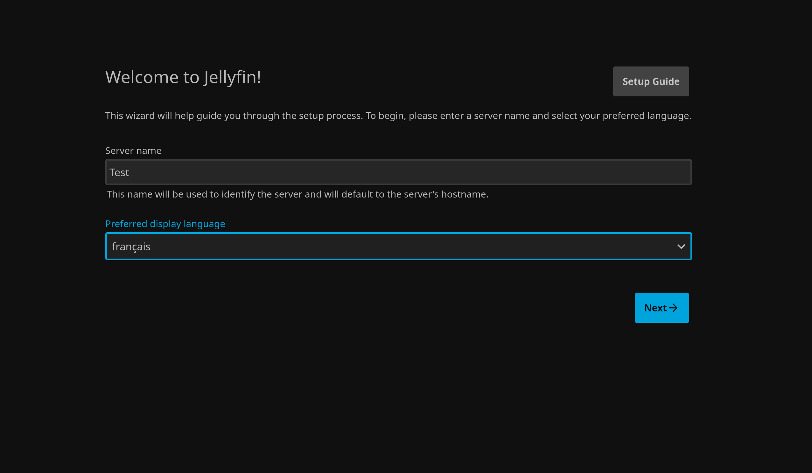 | 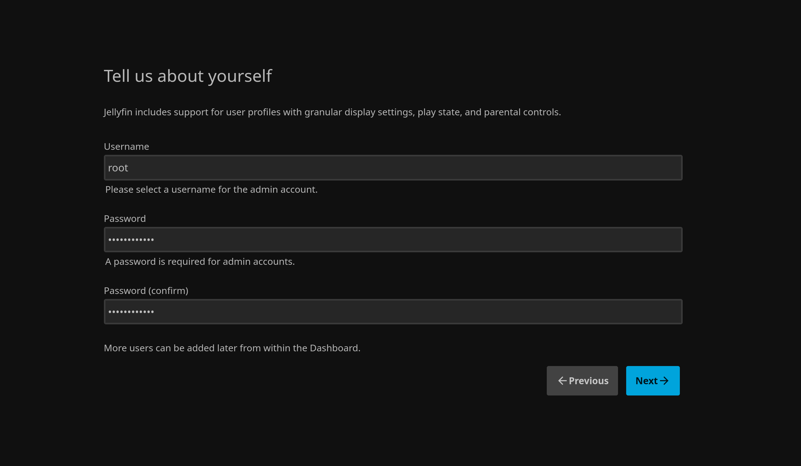 |
 
| Préférence des metadatas | Accès distant |
|---|---|
| 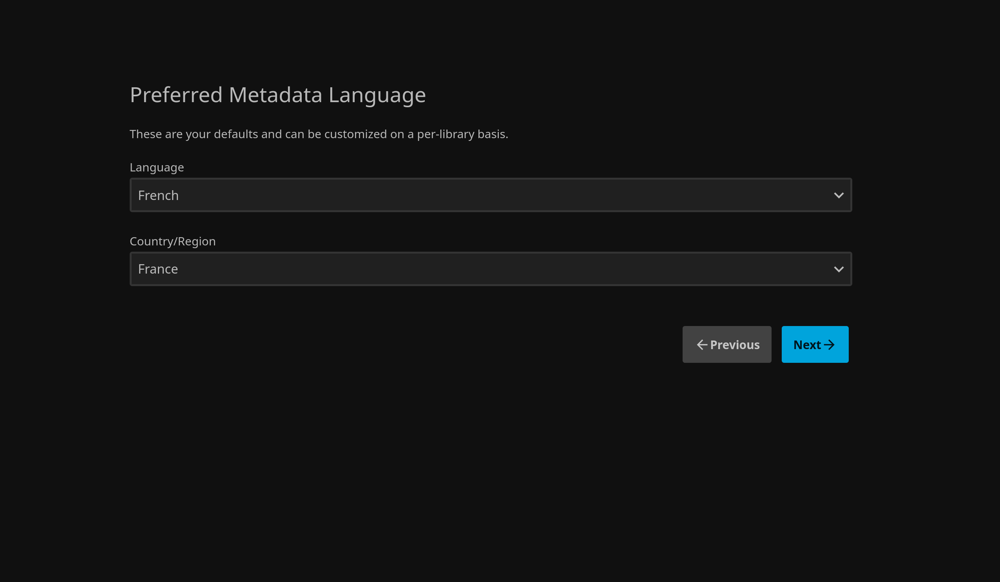 | 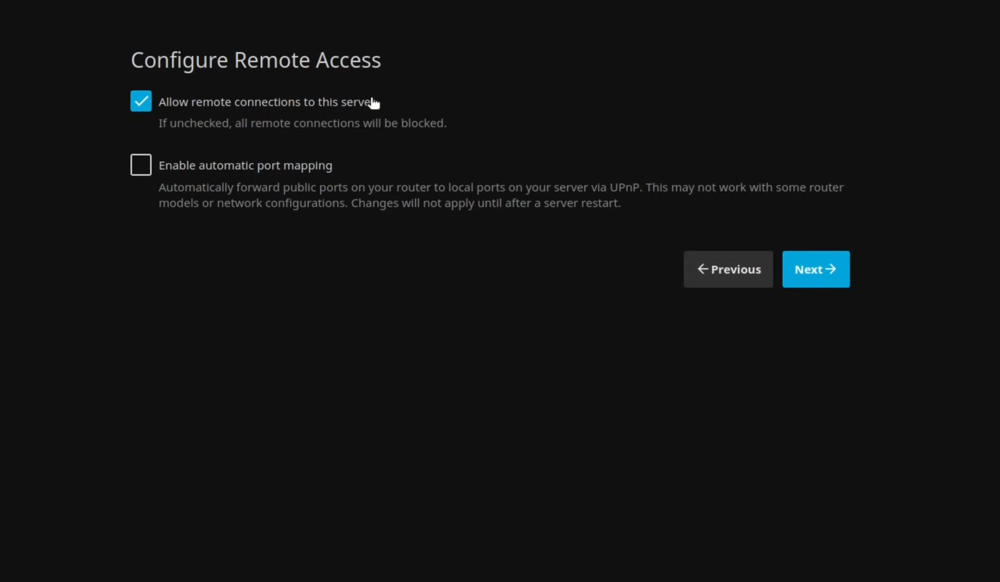 |

## 5. Login + Config

Pour commencer la configuration, se connecter avec le compte **root** créé précédemment.

En haut à droite, cliquer sur l'icon du profile puis cliquer sur **Dashboard**

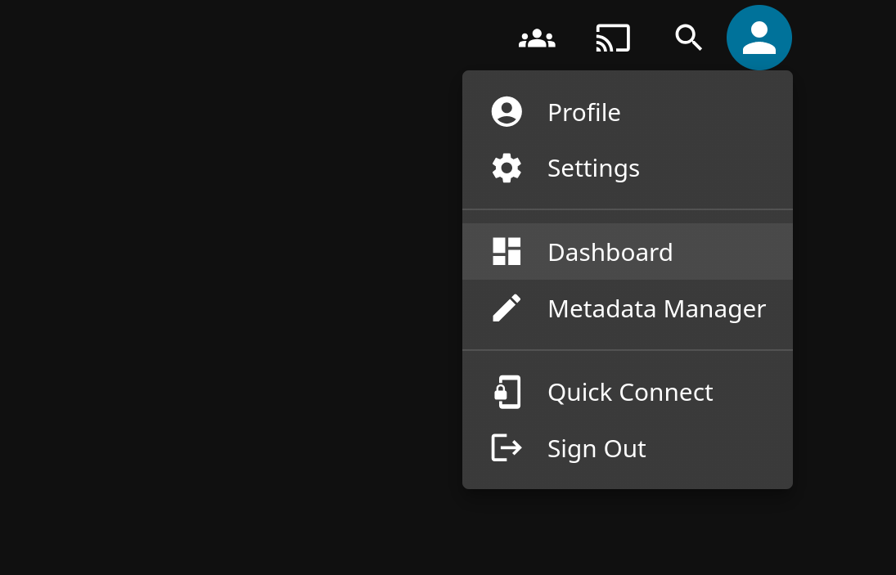


## 6. Configuration des bibliothèques

Pour chaque dossier ajouté, choisir le bon type de contenu (Séries / Films) afin que Jellyfin applique le bon système de reconnaissance (affiches, résumés, épisodes).

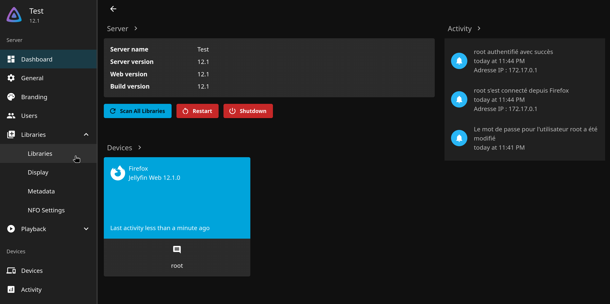

## 7. Ajout d'une bibliothèque

Nous allons créer une bibliothèque dédiée pour chaque utilisateur.

Nous avons pour exemple user_1 qui veut avoir des films uniquement sur son compte, non pas accessible par tout les autres utilisateurs qui ont accès au serveur jellyfin.

Avant de créer la bibliothèque dans Jellyfin, il faut d'abord créer le dossier dédié sur le serveur, dans le point de montage prévu pour les médias :

```bash
mkdir -p /mnt/contenu/user_1
```

| Lib user_1 | Dossier user_1 |
|---|---|
| 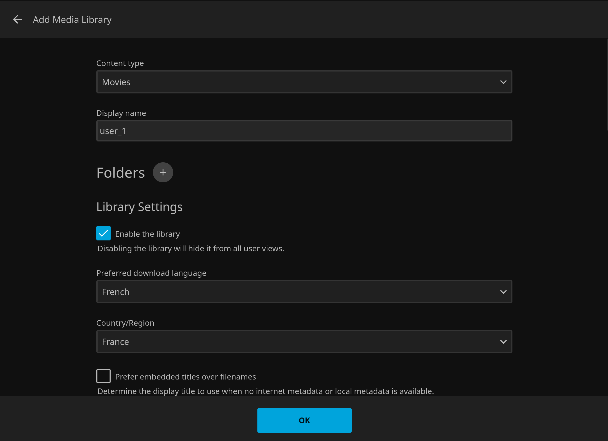 | 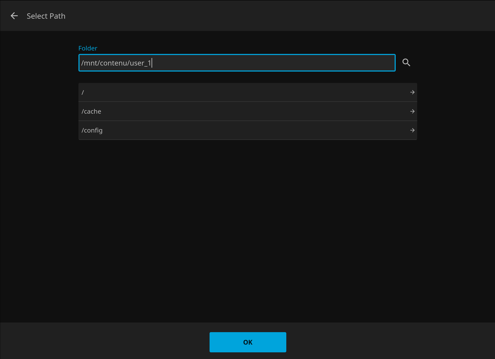 |

## 8. Création des comptes utilisateurs

Un compte par utilisateur (`User-1`, `User-2`...) dans **Tableau de bord → Utilisateurs**, avec accès restreint à ses propres dossiers si besoin de séparation.

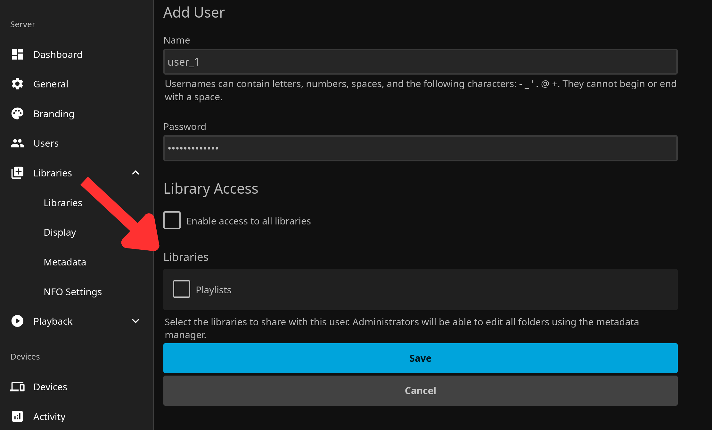

La lib concerné s'affichera dans **libraries**, surtout ne JAMAIS mettre **Enable access all libraries**

## 9. Vérification finale

- Lecture d'un fichier test depuis un navigateur
- Lecture depuis l'app mobile/TV Jellyfin
- Vérification que le transcodage fonctionne (si activé) sur un appareil ne supportant pas le format source

---

# Partie 2 — IA & Téléchargement

Cette partie est hébergée sur la seconde machine (**Serveur IA**). Elle rassemble le moteur de traitement en langage naturel (Ollama), le tunnel sécurisé (Gluetun VPN), les indexeurs (Prowlarr), le client de téléchargement (qBittorrent) et le backend d'automatisation.

---

## 1. Prérequis

- **Docker** et **Docker Compose**
- **Une carte graphique NVIDIA** avec le [NVIDIA Container Toolkit](https://docs.nvidia.com/datacenter/cloud-native/container-toolkit/latest/install-guide.html) installé (utilisée par Ollama)
- **Un compte VPN Mullvad** (clé WireGuard)
- **Un accès SSH par clé** vers le serveur Jellyfin, pour le transfert automatique des fichiers :

```bash
# Sur le serveur IA
ssh-keygen -t ed25519 -C "cinebrain"
ssh-copy-id -i ~/.ssh/id_ed25519.pub UTILISATEUR@IP_SERVEUR_JELLYFIN
```

## 2. Installation

Tout le code (backend, interface web, scripts de démarrage d'Ollama et de qBittorrent) est déjà inclus dans les images Docker : vous n'avez besoin que de **deux fichiers** et d'un dossier `config/`.

```text
/opt/cinebrain-ia/
├── docker-compose.yml       # Stack complète des conteneurs
├── .env                     # Vos réglages (VPN, identifiants, serveur Jellyfin)
└── config/
    └── temp_downloads/
        ├── User-1/          # Un dossier par utilisateur
        └── User-2/
```

Les autres éléments de `config/` (`wishlist.json`, `ollama_data/`, `qbittorrent/`, `prowlarr/`) sont créés automatiquement au premier démarrage.

### Récupérer les fichiers

```bash
mkdir -p /opt/cinebrain-ia && cd /opt/cinebrain-ia
curl -O https://raw.githubusercontent.com/Juyuroto/CineBrain/main/IA/docker-compose.yml
curl -o .env https://raw.githubusercontent.com/Juyuroto/CineBrain/main/IA/.env.example
```

### Créer les dossiers utilisateurs

Chaque dossier de `config/temp_downloads/` devient un utilisateur sélectionnable dans l'interface. Les médias de cet utilisateur sont ensuite déposés dans `DIR_JELLYFIN/<utilisateur>/` sur le serveur Jellyfin : utilisez donc les mêmes noms que les dossiers créés dans la Partie 1.

```bash
mkdir -p config/temp_downloads/User-1 config/temp_downloads/User-2
```

### Remplir le `.env`

```bash
nano .env
```

| Variable | Rôle |
| --- | --- |
| `WIREGUARD_PRIVATE_KEY`, `WIREGUARD_ADDRESSES`, `SERVER_CITIES` | Connexion au VPN Mullvad (fichier de configuration WireGuard fourni par Mullvad) |
| `LAN_SUBNET` | Votre réseau local (ex. `192.168.1.0/24`) : le VPN bloque tout le reste, ce réglage permet au backend de joindre le serveur Jellyfin |
| `TZ` | Fuseau horaire des conteneurs (`Europe/Brussels` par défaut) |
| `Frontend_Port` | Port de l'interface web de CineBrain (`3000` par défaut) |
| `QBIT_USER`, `QBIT_PASS` | Identifiant et mot de passe de qBittorrent, **appliqués automatiquement** (6 caractères minimum) |
| `OLLAMA_MODEL` | Modèle d'IA utilisé, **téléchargé automatiquement** au premier démarrage (`llama3.1` par défaut) |
| `PROWLARR_API_KEY` | Clé API de Prowlarr, à renseigner après sa configuration (étape 4) |
| `JELLYFIN_HOST`, `JELLYFIN_USER` | Adresse IP du serveur Jellyfin et utilisateur SSH utilisé pour le transfert |
| `DIR_JELLYFIN` | Dossier des bibliothèques sur le serveur Jellyfin (ex. `/mnt/contenu`) |

### Démarrer la stack

```bash
docker compose up -d
```

Au premier démarrage, Ollama télécharge le modèle d'IA (environ 5 Go pour `llama3.1`). Vous pouvez suivre sa progression avec :

```bash
docker compose logs -f ollama
```

### Mettre à jour CineBrain

```bash
docker compose pull
docker compose up -d
```

## 3. Fonctionnement du pipeline automatisé

Le code va exécuté dans le backend l'orchestration des actions suivantes :

```text
[ Demande Utilisateur ]
         │
         ▼
[ Ollama (Analyse IA) ] ──▶ Extraction du titre, année, langue
         │
         ▼
[ Prowlarr / VPN ] ───────▶ Recherche du meilleur fichier dans les sources légales configurées
         │
         ▼
[ qBittorrent ] ──────────▶ Téléchargement dans /downloads/User-X/
         │
         ▼
[ Backend ] ─▶ Nettoyage des metadatas & normalisation du nom
         │
         ▼
[ Transfert SCP ] ────────▶ Copie sécurisée vers Serveur Jellyfin (/mnt/contenu/...)
```

Logique de nettoyage et de transfert sécurisé

Le script applique des règles strictes lors de la livraison :
- Détection de type : Identification automatique des séries (S01E01, Saison 1) et des films.
- Nettoyage des tags : Suppression des éléments superflus (1080p, WEB-DL, x264, noms de sites web) sans détruire l'extension du fichier ni l'année ((1997)).
- Gestion des extras : Si un film contient des bonus (Featurettes, Storyboards), les fichiers conservent leurs noms individuels pour éviter d'être écrasés.
- Livraison distante : Création automatique du dossier cible via SSH puis transfert direct avec scp

## 4. Configuration Prowlarr

### Connexion et clé API

Accéder à Prowlarr via http://IP_SERVEUR_IA:9696 pour configurer la recherche automatisée :

1. Lorsqu'on arrive sur l'interface de Prowlarr, on crée l'utilisateur commun.

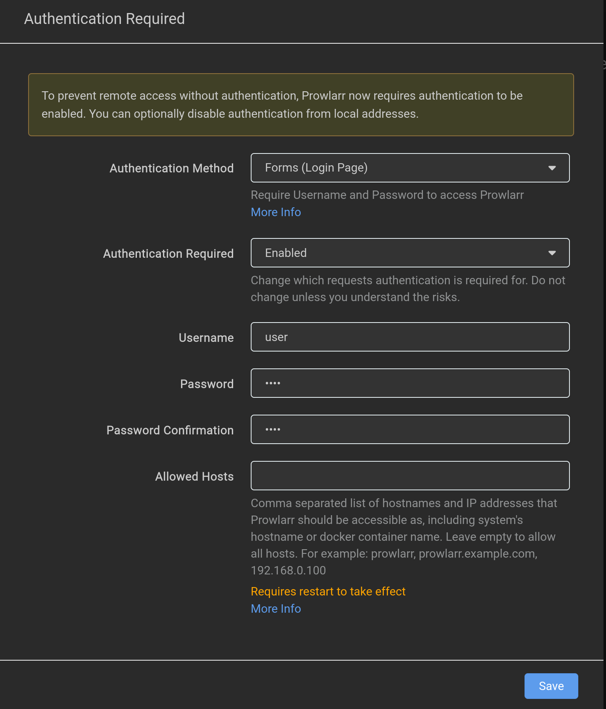

2. Une fois connecté, se rendre dans **Settings** → **General** pour copier la **clé API**.

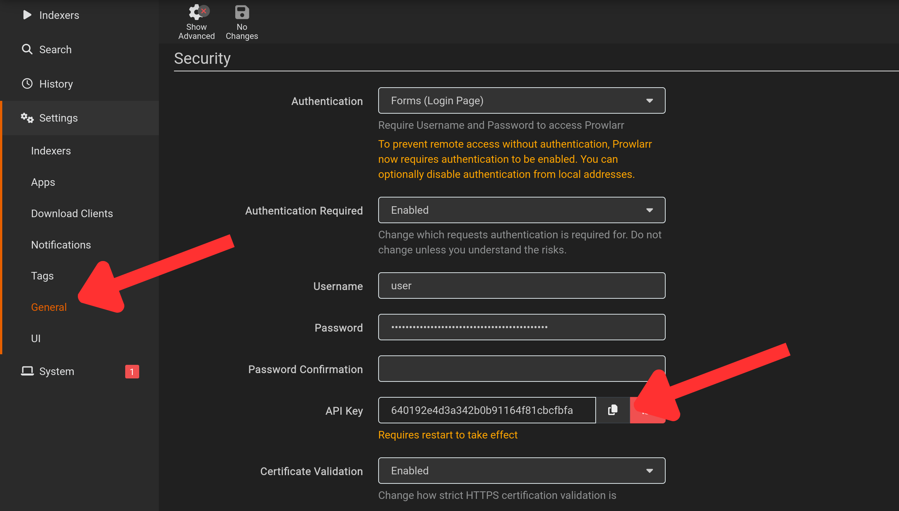

3. Coller cette clé dans `PROWLARR_API_KEY` du `.env`, puis relancer la stack pour que le backend la prenne en compte :

```bash
docker compose up -d
```

### Ajouter des indexers de recherche

1. Dans **Settings** → **Indexers**, ajouter les catégories de recherche (Films & Séries).

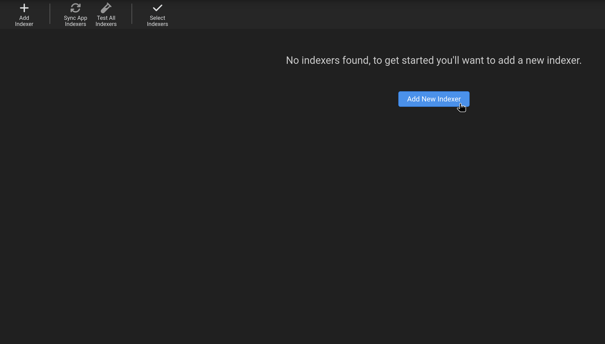

2. Dans **Indexers** → **Add Indexer**, ajouter **uniquement des sources légales** :
  - Par exemple **Internet Archive**, qui propose des films du domaine public et des œuvres sous licence libre.
  - N'ajoutez jamais d'indexeur qui diffuse des œuvres protégées sans l'autorisation des ayants droit.

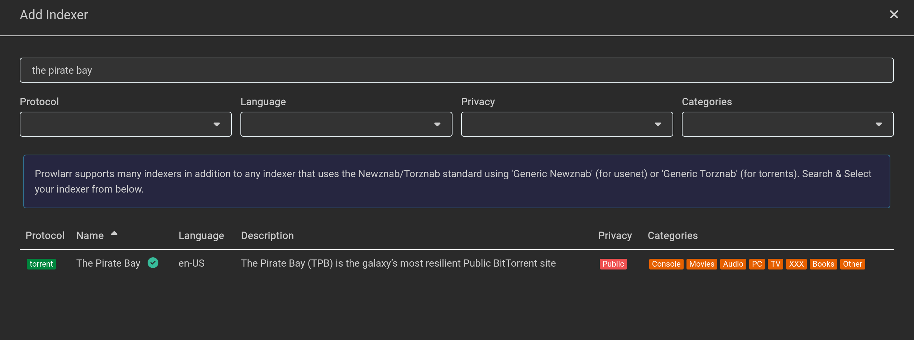

## 5. qBittorrent

**Aucune configuration nécessaire.** L'identifiant et le mot de passe de l'interface sont ceux de `QBIT_USER` et `QBIT_PASS` dans votre `.env` : ils sont appliqués à chaque démarrage du conteneur, et le backend y accède automatiquement.

Pour consulter vos téléchargements directement dans qBittorrent, rendez-vous sur http://IP_SERVEUR_IA:8080 :

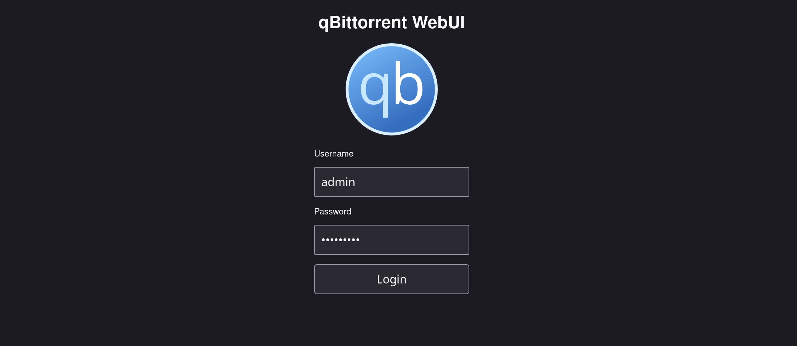

Pour changer le mot de passe, modifiez `QBIT_PASS` dans le `.env` puis relancez `docker compose up -d`.

## 6. Ajouter et profiter de vos médias

### L'interface WebUI de CineBrain

Accédez à la page web de votre outil via http://IP_SERVEUR_IA:3000 pour lancer vos recherches. L'interface reprend le style de Jellyfin : le menu à gauche donne accès à **Ma liste**, **Téléchargements**, **Éditeur JSON** et **Logs**.

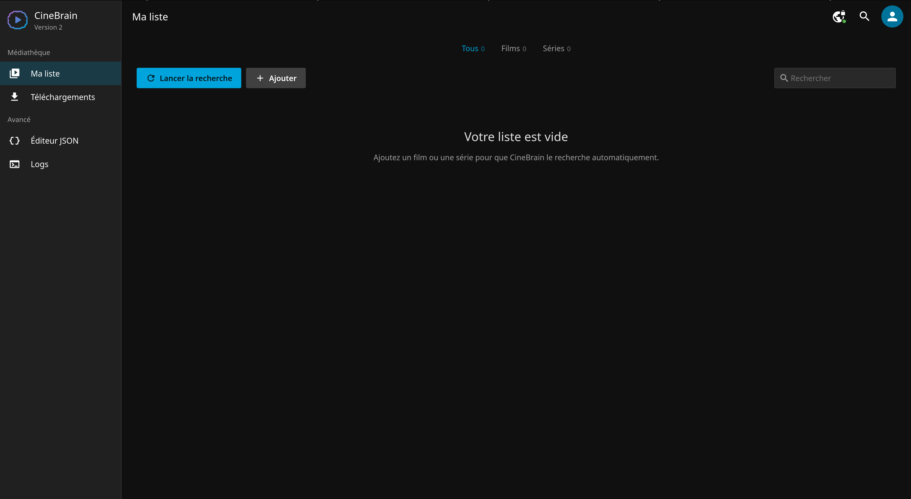

En haut à droite, l'icône du VPN porte une pastille d'état : **verte** quand le tunnel est connecté, **rouge** (clignotante) s'il est coupé. En survolant l'icône, vous voyez l'IP publique et le pays du VPN.

Cliquez sur **Ajouter**, renseignez le type de contenu, le titre, l'année (facultative), la langue et l'utilisateur, puis validez avec **Ajouter**.

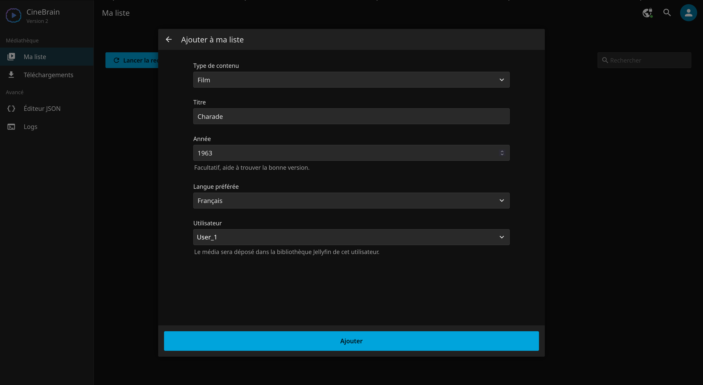

Le titre apparaît alors dans **Ma liste**. Les onglets **Tous / Films / Séries** et la barre de recherche permettent de filtrer la liste. Pour retirer un élément, survolez son affiche (ou touchez-la sur mobile) et cliquez sur l'icône de corbeille.

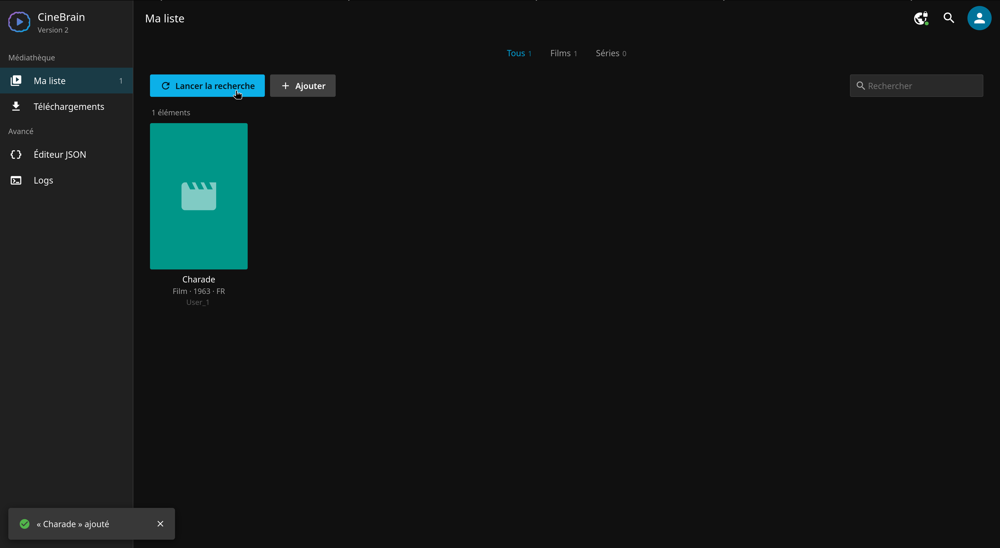

Cliquez sur **Lancer la recherche** pour laisser ensuite l'intelligence artificielle rechercher le film dans vos sources légales et le télécharger de manière 100% autonome.

### Suivi des téléchargements

La page **Téléchargements** affiche en temps réel les torrents en cours dans qBittorrent : progression, taille, vitesse et temps restant. Un résumé indique le nombre de téléchargements en cours, terminés et en erreur, ainsi que la vitesse totale. Vous pouvez filtrer par état (en cours, terminés, erreurs).

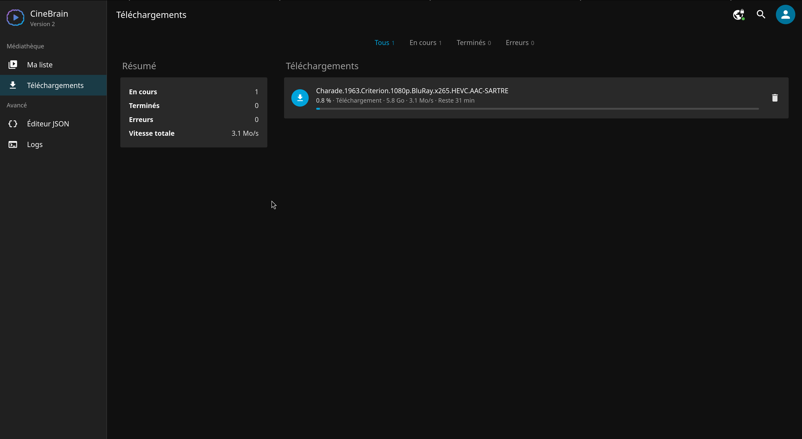

### Éditeur JSON

La page **Éditeur JSON** permet de modifier directement le fichier `wishlist.json`. Le JSON est validé à la volée, et vous pouvez enregistrer avec **Ctrl+S**.

### Logs du backend

L'entrée **Logs** du menu ouvre les logs du backend en direct. Vous pouvez les filtrer par niveau (Info, Avertissements, Erreurs) pour suivre chaque étape : recherche, ajout dans qBittorrent, transfert vers Jellyfin.

## C'est prêt !

Vous n'avez plus rien à faire. Une fois le téléchargement et le nettoyage terminés, le fichier apparaîtra automatiquement et proprement dans l'interface de votre serveur Jellyfin. Profitez de votre séance !